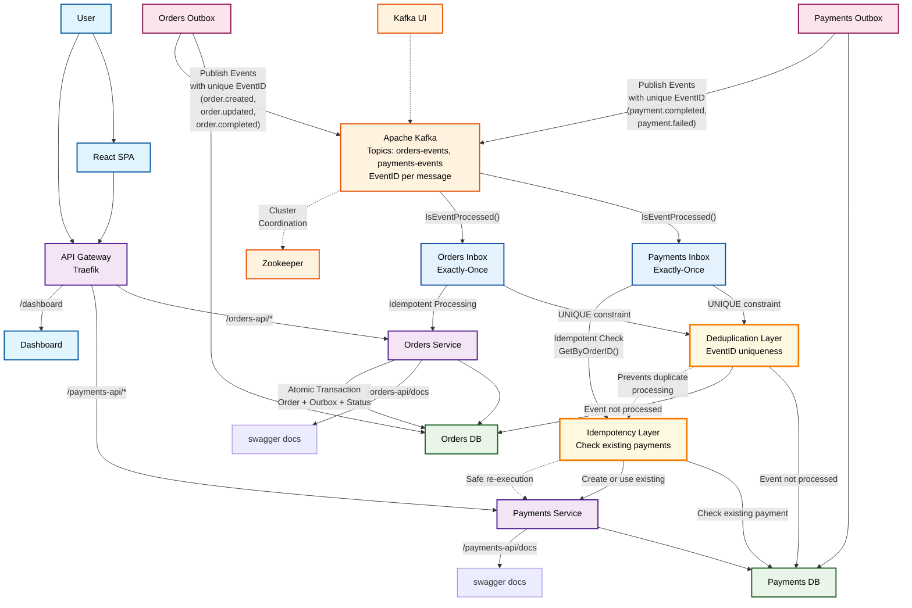

# Конструирование программного обеспечения
> Контрольная работа №3 <br> Асинхронное межсервисное взаимодействие.

## Описание системы

Система реализует микросервисную архитектуру с асинхронным межсервисным взаимодействием через Apache Kafka, используя паттерны **Inbox** и **Outbox** для обеспечения надежности доставки сообщений и eventual consistency, **exactly once** для оплаты заказа.

## Особенности реализации

1. Использование **SSE** (server-sent events) вместо WebSockets:
    1. Одностороннее общение
    2. Проще в использовании (Автоматическое переподключение)

2. Использование uuid v7 для id сущностей (часть доменного слоя).

3. Domain driven design

## Функционал

1. При инициализации клиентского приложения осуществляется запрос на создание пользователя (user id сохраняется в localStorage), также можно выйти из аккаунт и создать нового пользователя (кнопка logout).
2. Кнопка создания заказа (стоимость генерируется в orders-service).
3. Кнопка пополнения аккаунта (на 100 у.е.).
4. Клиент подписывается на изменения заказов и отслеживает изменения статусов заказов в реальном времени.

## Схема работы


### Быстрые команды

**Orders service <br> Payments service**
```sh
wire ./... # di gen
test ./... # test
swag init -g cmd/api/main.go # docs gen
```

**Orders client**
```sh
pnpm i # deps install
pnpm run dev # run in dev mode
```

**Запуск**
```sh
docker-compose up
```

**Запуск в minikube**
> Запустит 3 реплики <i>orders-service</i> и <i>payments-service</i>
```sh
minikube start
./k8s/build-images.sh
./k8s/deploy.sh
minikube tunnel
```
